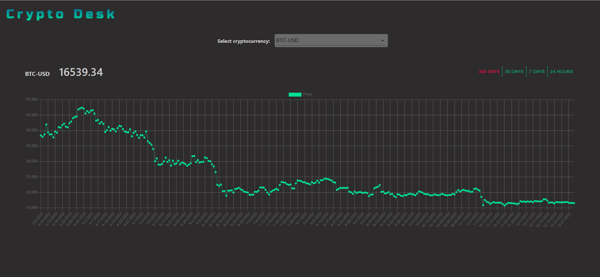

# CryptoDesk
React hooks and websockets app for displaying USD based real-time cryptocurrency prices and historical data.

The prices are being fetched from Coinbase API.

## Features
While using this app you can choose from a list of USB based cryptocurrencies to see their real-time prices. 
You can also see price change graphs for every cryptocurrency, in these intervals: 
* 300 days
* 30 days
* 7 days
* 24 hours

## Screenshots


## Technologies
Project is created with:
* React
* React Redux
* Chart.js
* React-chartjs-2
* Axios

## Setup
1. Clone repository:
```
git clone https://github.com/ibabaityte/CryptoDesk.git
```
### Install client
```
2. Install dependencies:
```
npm i
```
3. Start server:
```
npm start
```
